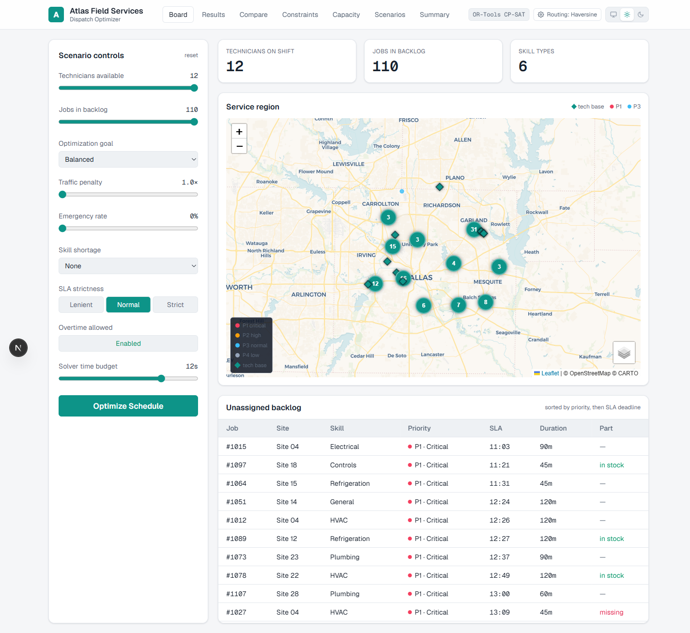
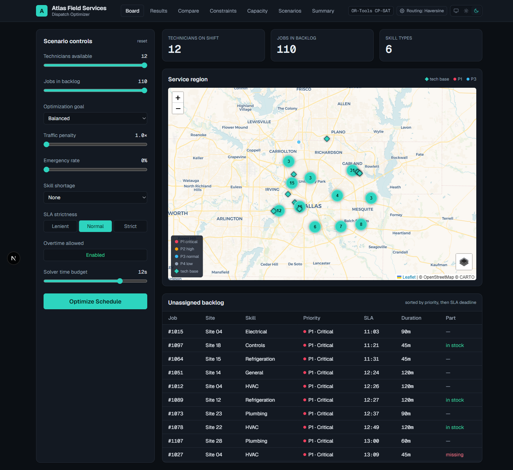
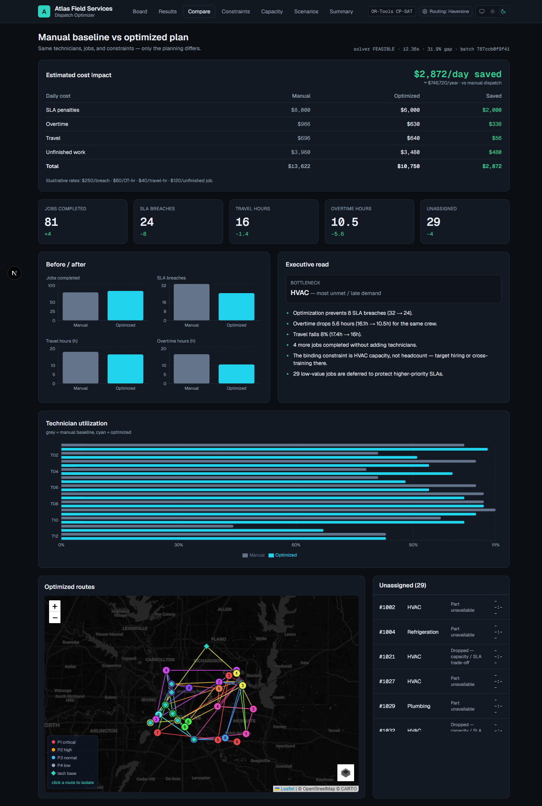
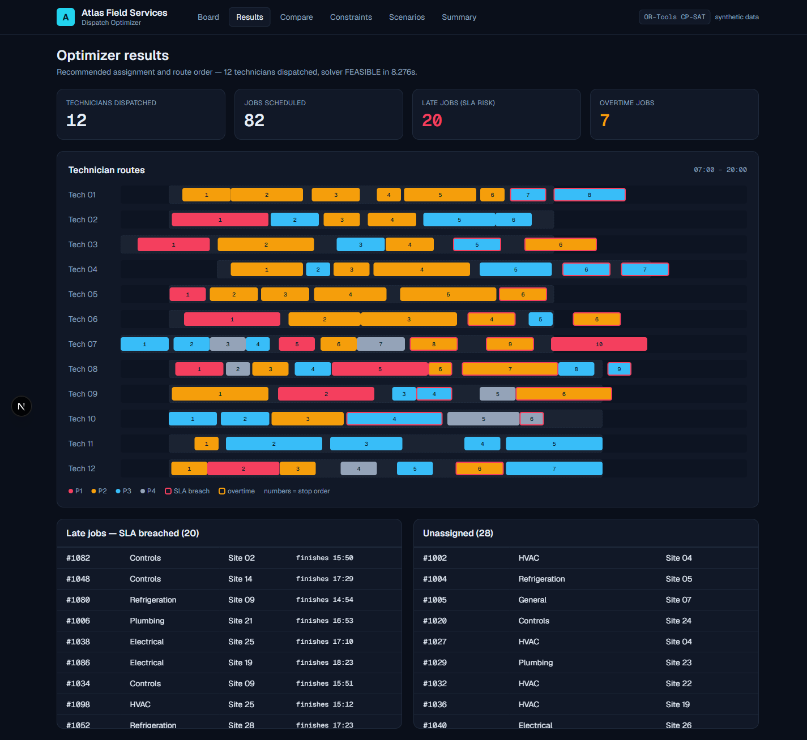
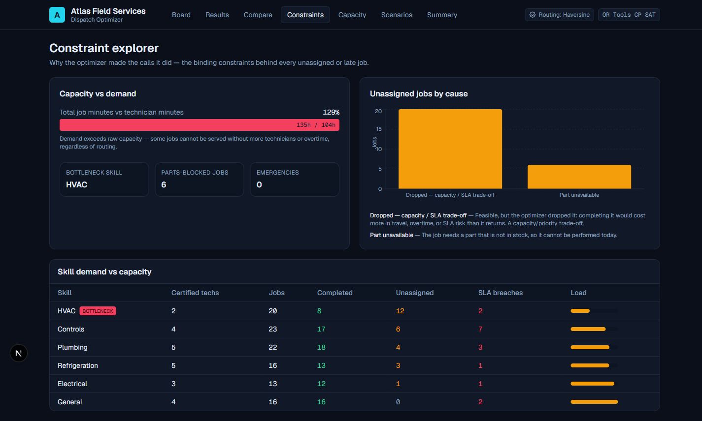
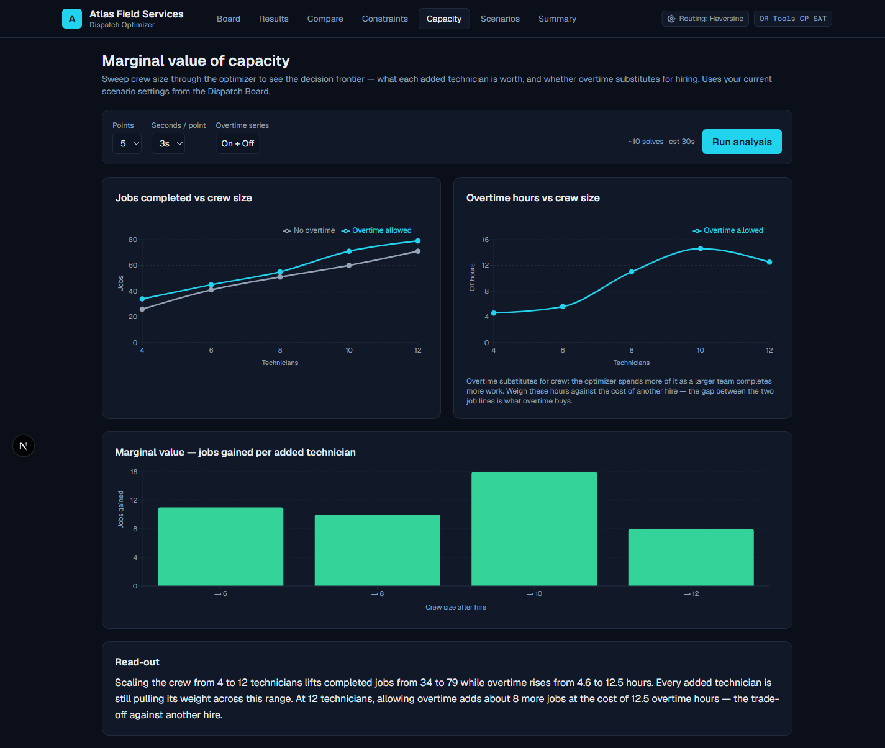
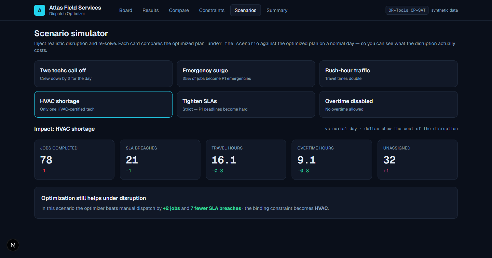
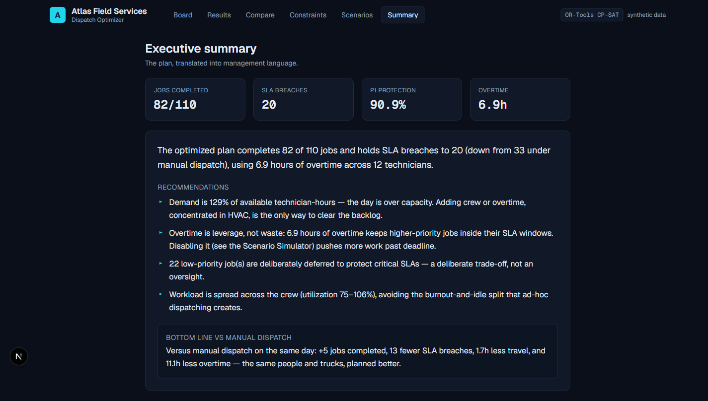

# Field Service Dispatch Optimizer

[](https://github.com/scottcampbelldata/field-service-dispatch-optimizer/actions/workflows/ci.yml)


A live operations-planning system that assigns technicians to service jobs under
real constraints — skills, travel, shift length, SLA deadlines, priority, job
duration, overtime, and parts — then compares an **OR-Tools CP-SAT optimized
plan** against a naive **manual dispatch baseline** to show measurable
operational impact.

This project doesn't just report on a business. **It makes a decision:** given
limited people, time, travel, skills, and SLA risk, what should we do next?

> Synthetic domain: **Atlas Field Services**, a commercial-facilities maintenance
> company. No proprietary or employer data is used — the dataset is fully
> synthetic and reproducible from a seeded generator.

<!-- Update these once deployed -->
* Live demo: https://dispatch.scottcampbell.io
* Live API: https://dispatch-api.scottcampbell.io
* API docs: https://dispatch-api.scottcampbell.io/docs

## Screenshots

### Light & dark — system-aware theming


### Dispatch Board — scenario controls, service region, backlog


### Baseline vs Optimized — the decision, quantified


### Optimizer Results — recommended routes and timing


### Constraint Explorer — why each decision was made


### Marginal Value of Capacity — the decision frontier


### Scenario Simulator — inject chaos and re-solve


### Executive Summary — the plan in management language


## The killer comparison

Same technicians, same jobs, same constraints — only the planning differs
(canonical day, seed 42, default settings):

| Metric | Manual baseline | Optimized | Change |
|--------|----------------:|----------:|-------:|
| Jobs completed | 77 | **81** | +4 |
| SLA breaches | 33 | **15** | −18 |
| Travel hours | 18.4 | **17.1** | −1.3 |
| Overtime hours | 18.0 | **7.5** | −10.5 |
| Unassigned jobs | 33 | **29** | −4 |

More jobs completed **and** fewer SLA breaches **and** less overtime, with the
same crew. See [docs/case-study.md](docs/case-study.md).

## Reviewer path

If you're reviewing quickly:

1. Open the live Dispatch Board, adjust a slider, and click **Optimize Schedule**.
2. Read the **Baseline vs Optimized** page — every click is a real CP-SAT solve.
3. Skim the model: [`backend/optimizer/cp_sat_model.py`](backend/optimizer/cp_sat_model.py)
   and [docs/optimization-model.md](docs/optimization-model.md).
4. Skim the baseline foil: [`backend/optimizer/baseline.py`](backend/optimizer/baseline.py).
5. Check the SQL reporting layer: [`backend/sql/analytical_views.sql`](backend/sql/analytical_views.sql).
6. Check the test suite: [`backend/tests/`](backend/tests) (`./tasks.ps1 test`).

## What it shows

- **A real optimizer**, not a heuristic dressed up as one: a VRPTW + assignment
  model in OR-Tools CP-SAT, with a bounded live solve.
- **An honest comparison**: the baseline obeys the same feasibility rules, so the
  delta is planning quality, not different assumptions.
- **Decision support**: bottleneck-skill detection, overtime-vs-SLA trade-offs,
  and explicit, reason-coded deferrals.
- **Full stack**: seeded synthetic data → SQL reporting views → API → dashboard.

## Quickstart (local, zero infrastructure)

Local development uses a SQLite file — no database to install.

```powershell
# Windows / PowerShell
./tasks.ps1 install     # venv + backend deps, and npm install for the frontend
./tasks.ps1 seed        # build + load the canonical day
./tasks.ps1 test        # run the backend test suite
./tasks.ps1 api         # FastAPI at http://localhost:8000
./tasks.ps1 web         # Next.js at http://localhost:3000  (separate terminal)
```

```bash
# Linux / macOS
make install && make seed && make test
make api          # terminal 1
make web          # terminal 2
```

Point the frontend at the API with `NEXT_PUBLIC_API_BASE` (default
`http://localhost:8000`).

## Full stack with Postgres (docker-compose)

```bash
docker compose up --build
# web  -> http://localhost:3000
# api  -> http://localhost:8000/docs
```

The same SQLAlchemy models and portable SQL views run on both SQLite (local) and
Postgres (compose / production).

## Maps & routing (bring your own key)

Sites and technicians are placed at real lat/long across the Dallas–Fort Worth
metro (still fully synthetic data) and rendered on a Leaflet map with keyless
CartoDB tiles. Travel times come from a **pluggable provider** chosen with
`ROUTING_PROVIDER`:

| Provider | Setting | Key needed | Notes |
|----------|---------|-----------|-------|
| Haversine | `haversine` (default) | none | Great-circle distance. Free, offline, reproducible — powers the public demo. |
| OpenRouteService | `openrouteservice` | **your** `ORS_API_KEY` ([free signup](https://openrouteservice.org/dev/#/signup)) | Real road-network durations via the Matrix API. |
| OSRM | `osrm` + `OSRM_BASE_URL` | none | Real road durations from a self-hosted or public OSRM server. |

Two ways to set the provider:

- **Server-side** via `.env` (below) — applies to everyone.
- **In-app, per visitor** via the **Routing** gear in the header — pick a provider
  and paste your own key; it is sent **per request for that browser session only**
  and never stored. This lets anyone try real road routing on the live demo
  without a key being configured on the server.

The provider is resolved per request and **degrades gracefully**: if it is
unconfigured, over the point cap, or the API call fails, travel falls back to
haversine and the active provider is reported in the optimize response and on the
Results page. **No key ever lives in the repo** — copy `.env.example` to `.env`
and set your own. The optimizer model is unchanged by the provider: travel is
resolved behind a single seam (`Instance.travel`), and the CP-SAT model already
uses directional arcs, so real asymmetric road times drop in with no model
changes.

```bash
# Enable real road routing with your own free key:
ROUTING_PROVIDER=openrouteservice
ORS_API_KEY=your-key-here
```

## Tech stack

Python 3.12 · OR-Tools (CP-SAT) · FastAPI · SQLAlchemy 2 · PostgreSQL / SQLite ·
Next.js (App Router) + TypeScript · Recharts · Leaflet · next-themes (system
light/dark) · OpenRouteService / OSRM (optional) · pytest · ruff · GitHub Actions.

## Project structure

```
backend/
  optimizer/   pure-Python engine: domain, travel, baseline, cp_sat_model, transform, metrics
  app/         FastAPI app, config, db, models, repository, generator, routing, solve_service
  sql/         portable analytical views
  tests/       optimizer, generator, persistence, and API tests
data-generator/  CLI to seed the database
frontend/      Next.js dashboard: / board, /results, /compare, /constraints, /capacity, /scenarios, /summary
docs/          architecture, optimization-model, data-dictionary, case-study
deploy/        systemd units, nginx, runbook
```

## Testing & CI

```bash
pytest -q                       # 61 tests
ruff check backend data-generator   # lint
```

Covers travel math, domain invariants, the greedy baseline, the CP-SAT model
(including the warm-start guarantee that the optimized objective and completed-job
count never fall below the baseline within the solve budget, plus optimality-gap
reporting), the parameter transforms, metrics, the cost model, capacity sweep,
generator determinism, persistence + SQL views, routing providers, and the API
endpoints.

**GitHub Actions** ([`.github/workflows/ci.yml`](.github/workflows/ci.yml)) runs
ruff + pytest on the backend and a type-checked Next.js build on the frontend for
every push and pull request to `main`.
