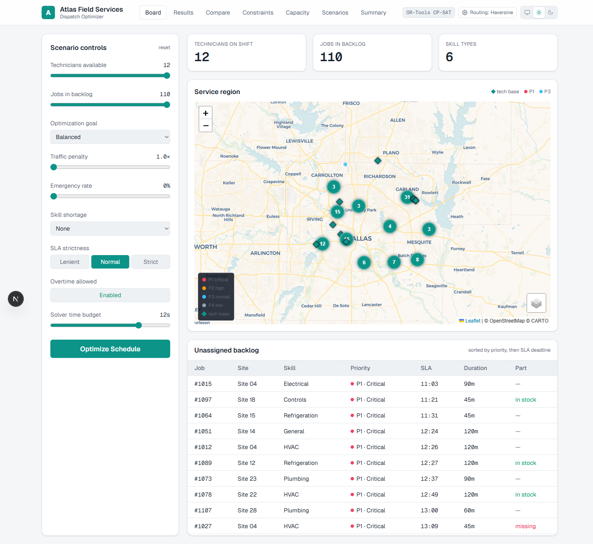
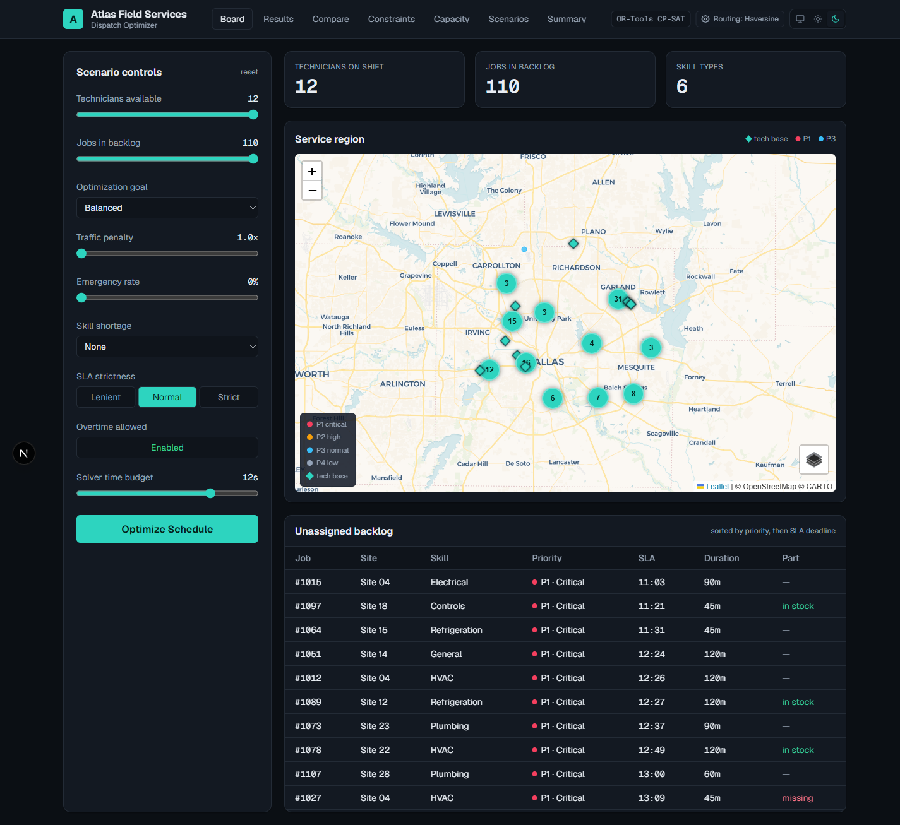
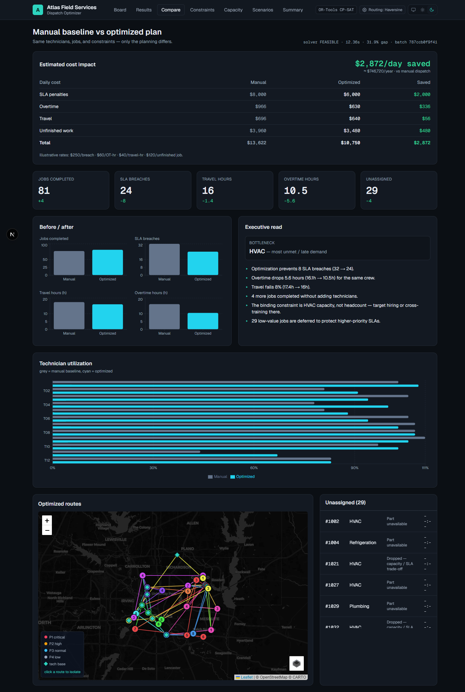
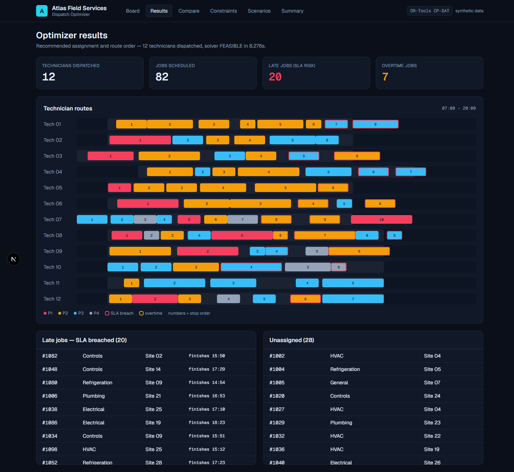
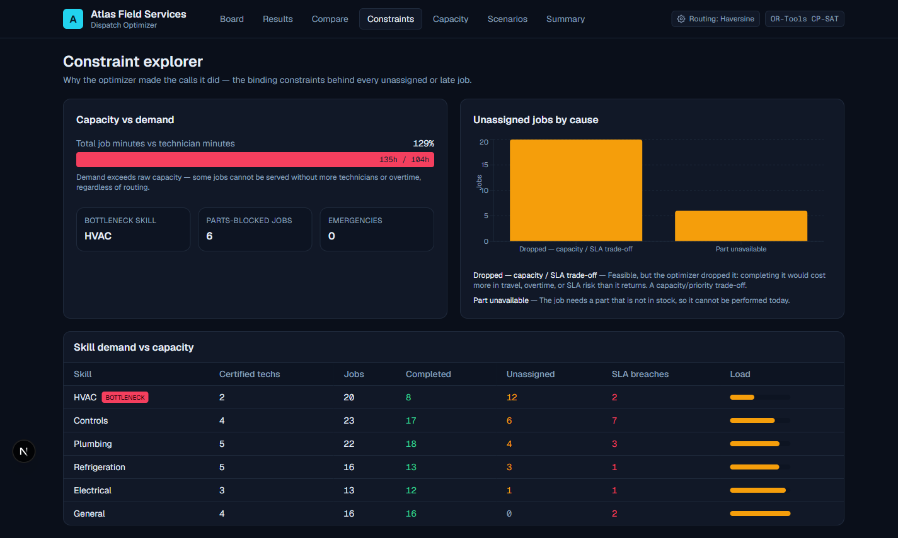
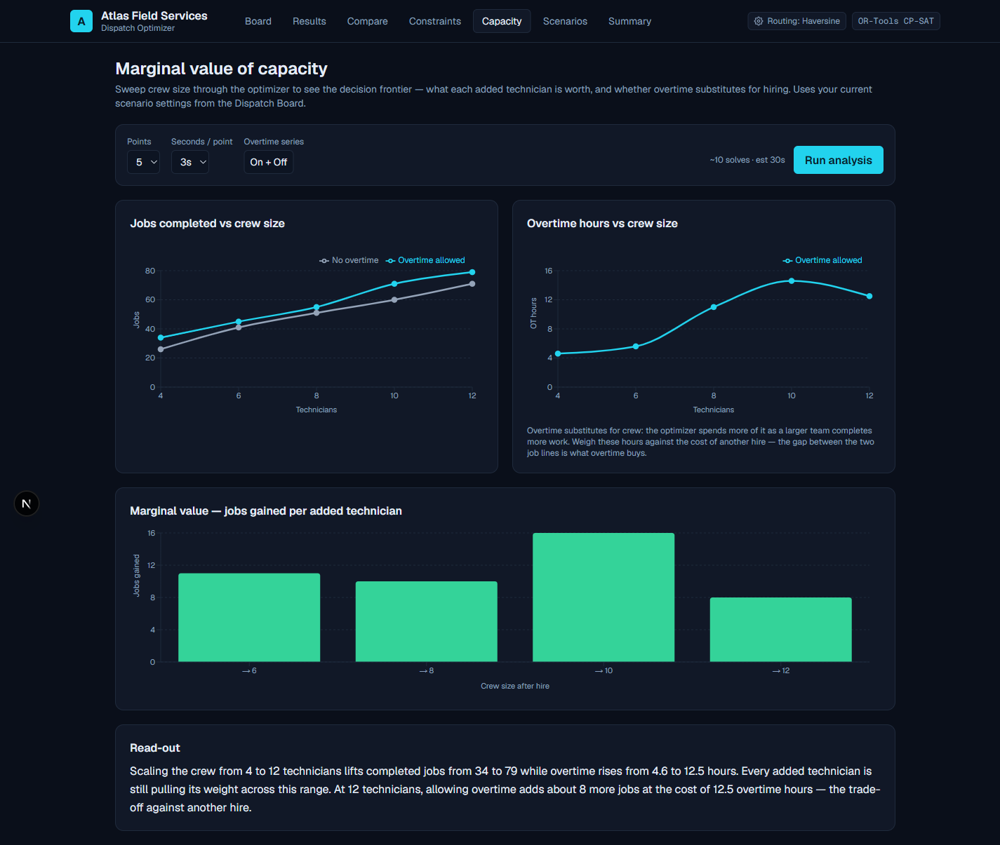
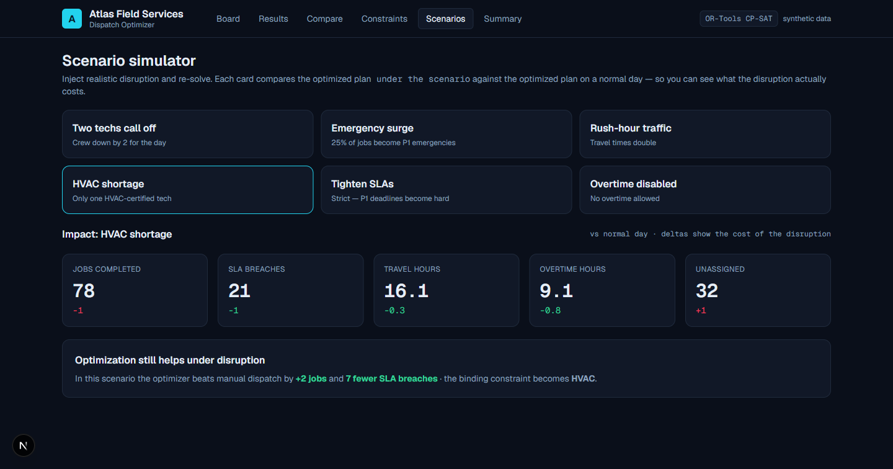
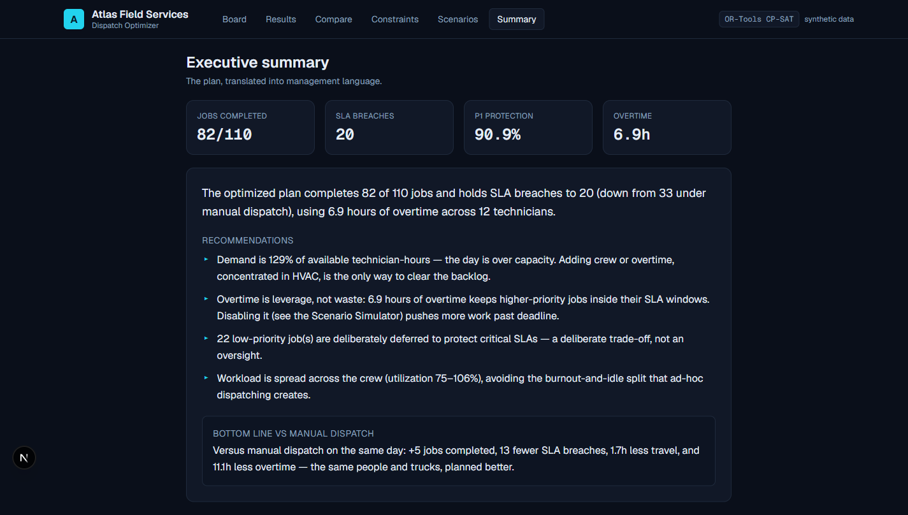

# Field Service Dispatch Optimizer

[](https://github.com/scottcampbelldata/field-service-dispatch-optimizer/actions/workflows/ci.yml)


**A field service scheduling tool that plans technician routes with an optimizer and compares the plan against manual dispatching, using synthetic data.**

Live at [dispatch.scottcampbell.io](https://dispatch.scottcampbell.io). More of my work is at [scottcampbell.io](https://scottcampbell.io).

A dispatch planner that assigns technicians to service jobs while respecting
skills, travel, shift length, SLA deadlines, priority, job duration, overtime,
and parts. It compares an **OR-Tools CP-SAT plan** against simpler
**manual-style dispatch baselines** and shows what changes.

The question it answers: given limited people, time, travel, skills, and SLA
risk, what should the dispatcher do next?

> Synthetic domain: **Atlas Field Services**, a commercial-facilities maintenance
> company. No proprietary or employer data is used. The dataset is fully
> synthetic and reproducible from a seeded generator.

* Live demo: https://dispatch.scottcampbell.io
* Live API: https://dispatch-api.scottcampbell.io
* API docs: https://dispatch-api.scottcampbell.io/docs

## Screenshots

### Light and dark theme


### Dispatch Board


### Baseline vs Optimized


### Optimizer Results


### Constraint Explorer


### Marginal Value of Capacity


### Scenario Simulator


### Executive Summary


## The comparison

The table this README used to lead with reported a single seeded day against a
deliberately naive baseline. It did not reproduce, and beating that baseline
proved very little: measured across 200 randomized scenarios, the naive
priority-first dispatcher misses a median of **45.6%** of the deadlines it
schedules. No real operation runs that way.

The baseline that belongs here is greedy nearest-qualified with a 2-opt
improvement pass and cheapest-insertion backfill (`backend/optimizer/greedy_2opt.py`),
which is roughly what an engineer writes in an afternoon without a solver.

Across 200 randomized scenarios (crew 6-18, backlog 70-150, varying skill mix,
emergency rate, and travel scale), at the shipped 8s solver budget:

| Comparison | SLA breaches (median) | 5th-95th pct | Overtime hours (median) |
|------------|----------------------:|-------------:|------------------------:|
| greedy+2-opt vs naive | **12 fewer** | 3 to 22 fewer | 3.35 fewer |
| CP-SAT vs naive | 5 fewer | 14 fewer to 0 | 2.20 fewer |
| CP-SAT vs greedy+2-opt | roughly at parity | | |

The greedy arms are deterministic and reproduce bit-identically. **The CP-SAT
arm does not**: `cp_sat_model.py` runs 8 search workers against a wall-clock
limit, so `random_seed=42` does not make it deterministic and per-scenario
results shift between runs. Treat its numbers as a distribution, not per-seed.

### The finding

CP-SAT is not ahead of a good heuristic at the budget this product ships. A
sweep over 24 scenarios at 2 / 8 / 30 / 60 seconds moves the median SLA
difference against greedy+2-opt from **+9 and +5 worse** to **3 and 5 better**.
The model is sound; the default time budget sits below the point where
constraint programming pays for itself. The old strawman baseline concealed
that, because 8 seconds looks like plenty against an opponent missing 45% of
its deadlines.

Reproduce: `python -m backend.experiments.seed_sweep --seeds 200 --solve-seconds 8`
and `python -m backend.experiments.budget_scaling --seeds 24 --budgets 2,8,30,60`.
Raw per-scenario rows are committed under `backend/experiments/results/`.

See [docs/case-study.md](docs/case-study.md).

## Where to look

If you only have a few minutes:

1. Open the live Dispatch Board, adjust a slider, and click **Optimize Schedule**.
2. Read the **Baseline vs Optimized** page. Every click runs a real CP-SAT solve.
3. Skim the model: [`backend/optimizer/cp_sat_model.py`](backend/optimizer/cp_sat_model.py)
   and [docs/optimization-model.md](docs/optimization-model.md).
4. Skim the baseline foil: [`backend/optimizer/baseline.py`](backend/optimizer/baseline.py).
5. Check the SQL reporting layer: [`backend/sql/analytical_views.sql`](backend/sql/analytical_views.sql).
6. Check the test suite: [`backend/tests/`](backend/tests) (`./tasks.ps1 test`).

## What's in it

- **The optimizer**: a VRPTW + assignment model in OR-Tools CP-SAT, with a
  time-limited live solve.
- **A fair comparison**: the baseline obeys the same feasibility rules, so the
  delta is planning quality, not different assumptions.
- **Decision support**: bottleneck-skill detection, overtime-vs-SLA trade-offs,
  and explicit, reason-coded deferrals.
- **Full stack**: seeded synthetic data → SQL reporting views → API → dashboard.

## Quickstart (local)

Local development uses a SQLite file, so there's no database to install.

```powershell
# Windows / PowerShell
./tasks.ps1 install     # venv + backend deps, and npm install for the frontend
./tasks.ps1 seed        # build + load the canonical day
./tasks.ps1 test        # run the backend test suite
./tasks.ps1 api         # FastAPI at http://localhost:8000
./tasks.ps1 web         # Next.js at http://localhost:3000  (separate terminal)
```

```bash
# Linux / macOS
make install && make seed && make test
make api          # terminal 1
make web          # terminal 2
```

Point the frontend at the API with `NEXT_PUBLIC_API_BASE` (default
`http://localhost:8000`).

## Full stack with Postgres (docker-compose)

```bash
docker compose up --build
# web  -> http://localhost:3000
# api  -> http://localhost:8000/docs
```

The same SQLAlchemy models and portable SQL views run on both SQLite (local) and
Postgres (compose / production).

## Maps & routing (bring your own key)

Sites and technicians are placed at real lat/long across the Dallas-Fort Worth
metro (still fully synthetic data) and rendered on a Leaflet map with keyless
CartoDB tiles. Travel times come from a **pluggable provider** chosen with
`ROUTING_PROVIDER`:

| Provider | Setting | Key needed | Notes |
|----------|---------|-----------|-------|
| Haversine | `haversine` (default) | none | Great-circle distance. Free, offline, reproducible. Used by the public demo. |
| OpenRouteService | `openrouteservice` | **your** `ORS_API_KEY` ([free signup](https://openrouteservice.org/dev/#/signup)) | Real road-network durations via the Matrix API. |
| OSRM | `osrm` + `OSRM_BASE_URL` | none | Real road durations from a self-hosted or public OSRM server. |

Two ways to set the provider:

- **Server-side** via `.env` (below). Applies to everyone.
- **In-app, per visitor** via the **Routing** gear in the header. Pick a provider
  and paste your own key; it is sent **per request for that browser session only**
  and never stored. This lets anyone try real road routing on the live demo
  without a key being configured on the server.

The provider is resolved per request and **falls back to haversine**: if it is
unconfigured, over the point cap, or the API call fails, travel falls back to
haversine and the active provider is reported in the optimize response and on the
Results page. **No key is stored in the repo.** Copy `.env.example` to `.env`
and set your own. The optimizer model is unchanged by the provider: travel is
resolved in one place (`Instance.travel`), and the CP-SAT model already
uses directional arcs, so real asymmetric road times drop in with no model
changes.

```bash
# Enable real road routing with your own free key:
ROUTING_PROVIDER=openrouteservice
ORS_API_KEY=your-key-here
```

## Tech stack

Python 3.12 · OR-Tools (CP-SAT) · FastAPI · SQLAlchemy 2 · PostgreSQL / SQLite ·
Next.js (App Router) + TypeScript · Recharts · Leaflet · next-themes (system
light/dark) · OpenRouteService / OSRM (optional) · pytest · ruff · GitHub Actions.

## Project structure

```
backend/
  optimizer/   pure-Python engine: domain, travel, baseline, cp_sat_model, transform, metrics
  app/         FastAPI app, config, db, models, repository, generator, routing, solve_service
  sql/         portable analytical views
  tests/       optimizer, generator, persistence, and API tests
data-generator/  CLI to seed the database
frontend/      Next.js dashboard: / board, /results, /compare, /constraints, /capacity, /scenarios, /summary
docs/          architecture, optimization-model, data-dictionary, case-study
deploy/        systemd units, nginx, runbook
```

## Testing & CI

```bash
pytest -q                       # tests
ruff check backend data-generator   # lint
```

Covers travel math, domain invariants, the greedy baseline, the CP-SAT model
(including the warm-start guarantee that the optimized objective and completed-job
count never fall below the baseline within the solve budget, plus optimality-gap
reporting), the parameter transforms, metrics, the cost model, capacity sweep,
generator determinism, persistence + SQL views, routing providers, and the API
endpoints.

**GitHub Actions** ([`.github/workflows/ci.yml`](.github/workflows/ci.yml)) runs
ruff + pytest on the backend and a type-checked Next.js build on the frontend for
every push and pull request to `main`.
